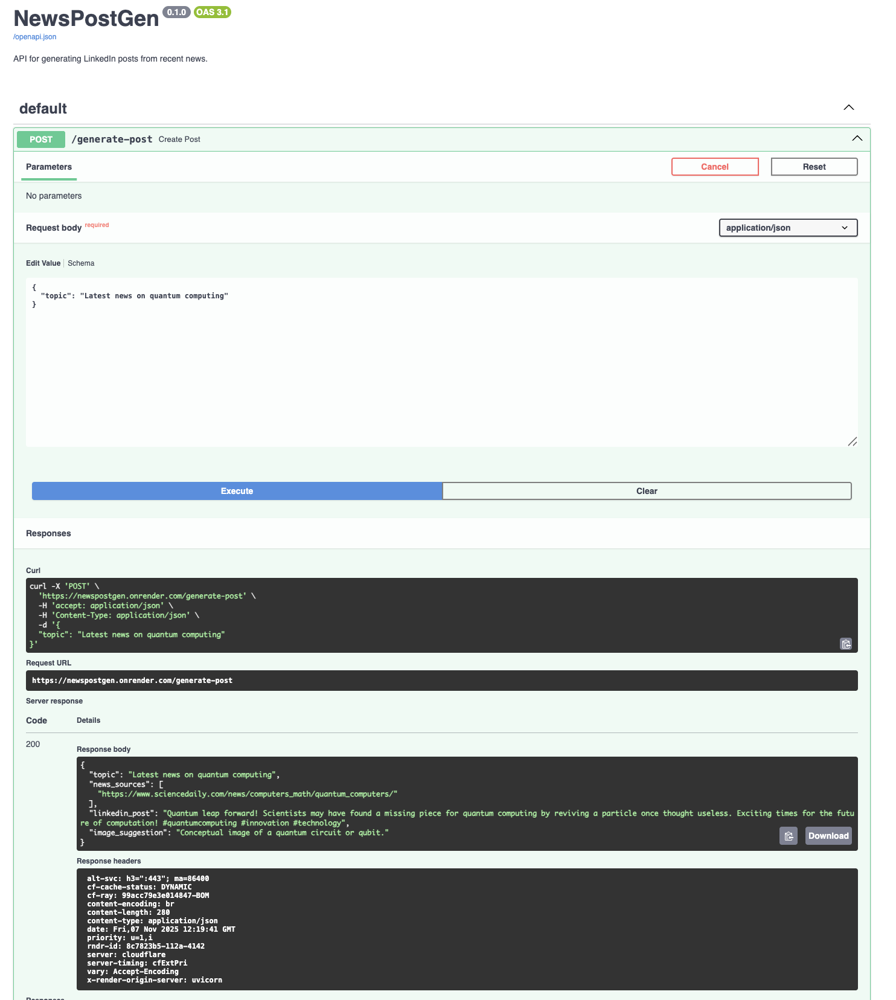

# NewsPostGen 🤖

[](https://www.python.org/)
[](https://fastapi.tiangolo.com/)
[](https://www.langchain.com/)
[](https://ai.google.dev/gemini-api/docs)
[](https://tavily.com/)
[](LICENSE)

An AI-powered FastAPI service that searches for recent news with Tavily and uses Google Gemini through LangChain to generate a LinkedIn-ready post with source URLs and an image suggestion.

---

## 🚀 Live Demo

Interactive Swagger docs:

**https://newspostgen.onrender.com/docs**



---

## ✨ Core Features

* **Recent News Retrieval:** Uses Tavily search to gather current articles for a requested topic.
* **LLM Content Generation:** Uses Google Gemini (`gemini-2.0-flash`) to synthesize retrieved information into a professional LinkedIn post.
* **Structured API Output:** Returns:
  * `topic`
  * `news_sources`
  * `linkedin_post`
  * `image_suggestion`
* **Deployable API:** FastAPI + Uvicorn application deployed on Render with interactive OpenAPI documentation.

## 🛠️ Tech Stack

* **Backend:** FastAPI, Uvicorn
* **AI Orchestration:** LangChain
* **LLM:** Google Gemini (`gemini-2.0-flash`)
* **Web Search:** Tavily Search API
* **Deployment:** Render

---

## ⚙️ Run Locally

### Prerequisites

* Python 3.10+
* Git

### Setup

```bash
git clone https://github.com/MeghnaB12/NewsPostGen.git
cd NewsPostGen
python3 -m venv venv
source venv/bin/activate  # Windows: venv\Scripts\activate
pip install -r requirements.txt
cp .env.example .env
```

Add your Google AI Studio and Tavily API keys to `.env`, then start the server:

```bash
uvicorn main:app --reload
```

Local docs are available at `http://127.0.0.1:8000/docs`.

## 📖 API Usage

Send a `POST` request to `/generate-post`:

```bash
curl -X POST 'https://newspostgen.onrender.com/generate-post' \
  -H 'accept: application/json' \
  -H 'Content-Type: application/json' \
  -d '{
    "topic": "AI in climate change"
  }'
```

Example response shape:

```json
{
  "topic": "AI in climate change",
  "news_sources": [
    "https://example.com/article-1",
    "https://example.com/article-2"
  ],
  "linkedin_post": "Generated post text...",
  "image_suggestion": "A visual concept for the post"
}
```

The returned source URLs are supplied by the search step; generated text should still be reviewed before publishing.
